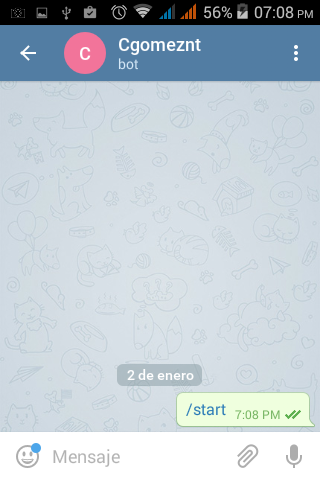

Telegram Bot API
===================

Los Telegram bots son cuentas especiales que sin un teléfono, se puede enviar mensajes de texto, imágenes o vídeo.

Telegram en una de sus ultimas actualizaciones lanzo una API para interactuar con BOTs. Nos permite enviar y recibir información del Bot. 

Aquí vamos a crear un Bot en su mas mínima expresión:

Lo primero que haremos es intalar y configurar una cuenta de Telegram en nuestro celular.

Al tener instalado telegram, vamos a llamar desde el al padre de los Bots que es @botfarher

llamamos a @botfather.

Le pasamos el comando /start

Luego el comando /newbot

Le damos /newbot y un nombre al bot

Luego el username

Si todo marcha bien @botfather nos manda el TOKEN

Desde el Telegram llamamos e iniciamos nuestro Bot (Esto para obtener el ID del chat)

Ahora llamamos la API Link::

GetMe
+++++++
::

	https://api.telegram.org/bot327956367:AAFPQhdnb_WA5f9T9I2Cx3LoQveLbnMHWKY/getme

	# Esta es la salida en JSON en el navegador
	{"ok":true,"result":{"id":327956367,"first_name":"Cgomeznt","username":"CgomezntBot"}}

GetUpdates
+++++++++++
::

	https://api.telegram.org/bot327956367:AAFPQhdnb_WA5f9T9I2Cx3LoQveLbnMHWKY/getupdates

	{"ok":true,"result":[{"update_id":355353584,
	"message":{"message_id":1,"from":{"id":294405920,"first_name":"Carlos G\u00f3mez"},"chat":{"id":294405920,"first_name":"Carlos G\u00f3mez","type":"private"},"date":1483398504,"text":"/start","entities":[{"type":"bot_command","offset":0,"length":6}]}}]}

SendingMessage
++++++++++++++++

Ya tenemos el ID del chat ya le podemos enviar mensajes al Bot.::

	https://api.telegram.org/bot327956367:AAFPQhdnb_WA5f9T9I2Cx3LoQveLbnMHWKY/sendmessage?chat_id=294405920&text=Saludando%20al%20Bot

	{"ok":true,"result":{"message_id":2,"from":{"id":327956367,"first_name":"Cgomeznt","username":"CgomezntBot"},"chat":{"id":294405920,"first_name":"Carlos G\u00f3mez","type":"private"},"date":1483399024,"text":"Saludando al Bot"}}

Y podremos ver el mensaje en el chat con el Bot.

Nosotros le respondemos al Bot desde el telegram.

GetUpdates otra vez
++++++++++++++++++++
Obtenemos nuevamente la lectura del chat con el Bot, como veran ahi se vera todo el chat::

	https://api.telegram.org/bot327956367:AAFPQhdnb_WA5f9T9I2Cx3LoQveLbnMHWKY/getupdates

	{"ok":true,"result":[{"update_id":355353584,
	"message":{"message_id":1,"from":{"id":294405920,"first_name":"Carlos G\u00f3mez"},"chat":{"id":294405920,"first_name":"Carlos G\u00f3mez","type":"private"},"date":1483398504,"text":"/start","entities":[{"type":"bot_command","offset":0,"length":6}]}},{"update_id":355353585,
	"message":{"message_id":3,"from":{"id":294405920,"first_name":"Carlos G\u00f3mez"},"chat":{"id":294405920,"first_name":"Carlos G\u00f3mez","type":"private"},"date":1483399285,"text":"Muy bien, ahora yo le escribo al Bot desde aqui"}}]}

Ahora en el CURL
+++++++++++++++

Con el comando curl podemos obtener valores del campo "text" con algun script y se me ocurre que tengamos un Raspberry PI y le mandemos valores como numeros y dependiendo de eso activamos el GPIO, como por ejemplo para encender una luz, aire acondicionado, calentador etc::

	$ curl  https://api.telegram.org/bot327956367:AAFPQhdnb_WA5f9T9I2Cx3LoQveLbnMHWKY/getupdates

	{"ok":true,"result":[{"update_id":355353584,
	"message":{"message_id":1,"from":{"id":294405920,"first_name":"Carlos G\u00f3mez"},"chat":{"id":294405920,"first_name":"Carlos G\u00f3mez","type":"private"},"date":1483398504,"text":"/start","entities":[{"type":"bot_command","offset":0,"length":6}]}},{"update_id":355353585,
	"message":{"message_id":3,"from":{"id":294405920,"first_name":"Carlos G\u00f3mez"},"chat":{"id":294405920,"first_name":"Carlos G\u00f3mez","type":"private"},"date":1483399285,"text":"Muy bien, ahora yo le escribo al Bot desde aqui"}}]}

::

	$ curl -s  https://api.telegram.org/bot327956367:AAFPQhdnb_WA5f9T9I2Cx3LoQveLbnMHWKY/getupdates | tail -1 | awk  -F":" '{print $12}'
	"Muy bien, ahora yo le escribo al Bot desde aqui"}}]}

